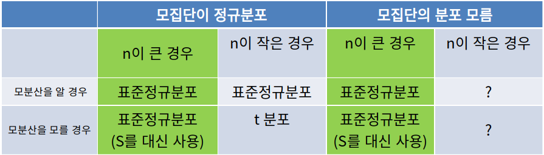

# 용어 정리

* **S2**  : 표본 분산
* **S** : 표본표준편차
* **o2** : 모분산
* **o** : 모집단의 표준편차 

# 제 8 장 : 표본의 분포

최대한 모든 케이스에서 가장 올바른 표본 분포를 구하기 위해 여러 분포를 공부한다.

외울 것 : t분포, F분포, 카이제곱분포

- **정규모집단** = **정규**분포를 따르는 **모집단

- x의 표본 평균 = (모든 표본의 합) / (모든 표본의 개수) = ( x1 + x2 + x3 + ... + xn ) / n

  ​			   x의 표본 평균 (X 바) 도 통계량 중 하나이다.

- **통계량**

  - 모집단의 모수들을 **추측**하기 위해 사용되는 값
  - **표본분포** = 통계량들의 확률분포 = 확률변들의 함수의 확률 분포 = 확률 표본의 측정 값들의 함수의 확률 분포
  - **통계량** = 확률변수들의 함수 형태 = 확률 표본의 측정 값들의 함수형태
  - **확률변수** = 확률표본의 측정값

## 8.1) 정규모집단의 표본분포

### [사용 조건]

- 모집단이 정규분포를 따르는 경우

### [사용 결과]

#### 표본 평균 X Bar

​	표본 평균 X Bar = (전체 표본의 합) / (전체 표본의 개수) 는 N(u, o2 / n) 을 따른다.

#### 표본 평균의 평균 = u

#### 표본 평균의 분산 = o2/n

#### 모집단의 분산을 모르는 경우

​	표본분산 S2을 모분산 o2의 추정량로 사용한다. 

### [관련 문제]

1. 표본평균과 모평균과의 차이가 k 이내일 확률은?

   P(|x̄ - u| <u><</u> k) 꼴로 만들어서 풀기 

2. 표본평균과 모평균과의 차이가 k 이내가 될 확률이 p가 되려면 필요한 표본의 개수는?

   P(|x̄ - u| <u><</u> k) = p 꼴로 만들고 분산에서 사용되는 n을 구하기

## 8.1'5) 카이제곱분포

무언가2이면 대부분 카이제곱분포로 푼다.

표준정규분포를 따르는 확률변수의 제곱의 합에 대한 분포

표본의 크기 N이 곧 자유도 v 이다. 

자유도가 낮을수록 왼쪽에 치우쳐져 있으며, 높을수록 정규분포처럼 바뀐다.

**자유도** 속박된 조건을 제외한 자유로운 확률변수의 개수

만약 모집단의 평균을 사용하면 자유도는 n, 표본 평균의 평균을 사용하는 경우 자유도는 n-1이 된다.

### [사용 결과]

#### 표본 평균의 평균 = v

#### 표본 평균의 분산 = 2v

#### 감마함수

  "정수"에만 정의된 factorial을 "실수"로 확장한것 

1. 이 양의 정수인 경우 감마(r) = (r - 1)!
2. 모든 r에 대해 감마(r) = r * 감마(r)
3. 감마(1/2) = ㅠ1/2

### Z가 표본정규분포를 따른다면, Z2은 자유도가 1인 카이제곱분포를 따른다.

=> 샘플의 통계량을 통해 모집단의 모수를 추정하는 데 중요한 역할을 한다.

### [관련 문제]

1. 표준정규분포를 따르는 모집단으로부터 추출한 표본 Zi 가 있다. P(Zi의 제곱의 합 <u><</u> a) = 0.95 를 만족하는 상수 a의 값은? ( 단,  표본의 개수 n은 상수로 주어진다. )

   표본의 개수 n를 찾아 자유도를 구한다.

   자유도가 n이고 오른쪽 면적이 0.05인 a값을 찾는다.

2. n 개의 음료수병을 랜덤하게 추출하여 표본분산 S2에 대해 알아보려고 한다. 이때, P(S2 <u><</u> a) = 0.95 인 상수 a는?

   ( 단, n과 o는 상수로 주어진다. )

   자유도가 n이고 오른쪽 면적이 0.05인 값을 k라고 하자.

   그리고  S2 <u><</u> a 를 카이제곱분포 형식으로 바꾸면  (n - 1) * S2 / o2 <u><</u> (n - 1) * a / o2  이므로 n - 1인  카이제곱 분포를 따른다. (n - 1) * a / o2 = k 라고 한 뒤, 전개해서 문제를 푼다.

## 8.2) 중심극한정리

충분히 큰 샘플을 추출한 경우 모집단의 분포와 상관없이 **표본평균의 분포**는 근사적으로 정규분포를 따른다.

많은 분석 방법들이 중심극한정리르 이론적 배경으로 사용하고있다.

### [사용 조건]

- 표본의 크기가 30보다 큰 경우

### [사용 결과]

- 표본평균 ~ N(u, o2/n) 
- 표본분산(S2) ~ N(nu, na2)

### [특징]

* 모집단의 분표가 좌우 대칭에 가깝다면 표본의 크기가 작더라도 잘 맞는다.

* 한쪽으로 크게 치우쳐져 있다면 표본의 크기가 커야한다.

  -> 하지만 표본의 크기가 30 이상이면 중심극한정리를 적용해도 된다.

### [관련 문제]

1. 평균이 a 이고 분산이 b 라고 한다. n명의 고객이 모두 서비스를 받는데 걸리는 시간이 m이내일 확률은?

   ( a, b, n, m이 모두 주어진다. )

   이 경우 n * a 를 통해 전체 고객의 평균 시간이 된다.

   이 경우 x <  m 를 표준정규분포로 유도하여 구하면 된다.

2. 평균이 a, 분산이 b2이다. 어느 부분 집단의 n명의 평균이 k일 때, 해당 부분 집단이 전체집단의 평균보다 작은가?

   n 이 30보다 큰 경우 평균 k에 대하여 전체 집단의 a, b를 이용하여 구한다.

   평균보다 작은지는 (k - a) / (b/n1/2) 를 통해 알아본다.

## 8.2'1) 베르누이분포(p)를 따르는 모집단

이항분포의 정규근사의 이론적 근거도 중심극한정리이다.

### [사용 조건]

- np = 성공 평균 횟수
- nq = 실패 평균 횟수
- np > 5 또는 nq > 5 인 경우 정규근사를 사용해도 무관 ( 보수적으로 10보다 큰 경우를 사용하기도 함 )

### [사용 결과]

- 평균 u= p
- 분산 o2 = p(1-p)
- X ~ N(np, np(1-p))
- 표본비율(p hat) ~ N(p, p(1-p)/n)

## 8.3) 정규모집단이 아닌 경우의 표본분포 ( n이 큰 경우 )

### [사용 조건]

분포가 정규분포를 따르지 않지만, n <u>></u> 30 인 경우

### [사용 결과]

X ~ N(u,o2/n) 이다.

### [관련 문제]

1. f(x) = 1/5 = k 를, x = 1,2,3,4,5인  이산균일분포를 따른다. n = 36의 표본을랜덤하게 추출하였다. 표본평균이 2보다 크고 3보다 작을 확률

   먼저, 이산균일분포의 평균과 분산을 구한뒤 2 < X < 3 으로 하고 처리.

2. A제품의 평균과 표준편차와 B제품의 평균과 표준편차가 주어졌을 때, 두 제품을 랜덤 추출하여 표본평균을 비교하는 경우

   표본의 크기가 충분히 큰경우 표본평균을 구한다. 표본 평균은 어디에서 어딜 빼나, 분산은 더해야한다.

## 8.4) t분포

모분산도 모르고, 크기가 작은 경우 사용한다.

T = Z / root(v/(n-1)) 

V = (n-1) * S2 / o2 는 자유도가 n - 1인 카이제곱분포를 따른다.

### [특징]

t분포의 형태는 표준정규분포와 매우 유사하다.

평균 0을 중심으로 좌우 대칭이며, 종 모양을 띠고 있다.

1) 표준정규분포와 매우 유사하나, 같은 것은 아니다.

2) (1)을 중심으로 좌우 대칭이며,  종 모양을 띤다.

자유도가 커질수록 표준정규분포에 가까워진다.

- 좌측열 : 자유도

- ta : 오른쪽 면적 a인 t값을 나타낸다.

- t1-a = - ta 

### [관련 문제]

1. P( -t0.05 < T < t0.025 ) 은 얼마인가?

2. 자유도가 15인 경우 P(k < T < -1.753) = 0.045가 되는 K는?

   1.753이랑 대응되는 녀석을 하나 찾는다. 그 녀석과 0.045 와의 차를 구한다. 차에 맞는 k값을 구한다.

3. 평균이 m이라 주장하는데 n개의 형광등을 랜덤하게 추출해서 수명 실험을 함. ( n < 30 ) 이때,  표본평균이 x시간, 표본표준편차가 s시간 이다. P(X < x) <u>></u> 0.95 이어야 한다면, 회사의 주장이옳다고 할 수 있는가? 형광등의 수명은 정규분포를 따른다고 가정하자. ( m, n, n, x, s 는 주어진다 ) 

## 8.5) F분포

표본으로부터 도출되는 통계량에 적용되는 주요한 분포중 하나.

"표본 분산"의 비율을 구하기 위해 사용 ... 표본 분산의 비율 = o12/o22 은 무엇일까? 에 대해..

F분포를 따르는 대표적인 통계량 : 카이제곱분포를 따르는 2개의 확률변수의 비율

F = (U/v1) / (V/v2)  U = 자유도가 v1인 카이제곱분포를 따름, V = 자유도가 v2인 카이제곱분포를 따름

### [특징]

- F분포 = 자유도가 2개이다.,

- Fa(v1,v2) = F분포의 곡선에서 Fa(v1,v2) 보다 큰 면적이 a가 되는 값을 의미한다.
- F = (S12/o12)/(S22/o22) 

### [관련 문제]

- 모분산이 동일하다고 알려져 있는 두 정규 모집단으로부터 각각 n1 = 6과 n2=10인두 확률표본을 독립적으로 추출하였다. 이때, P(S12 / S22 < a) = 0.95  가 되는 a 는 무엇인가?

  ... F = (S12/o12)/(S22/o22)  이라 한뒤  자유도 = 전체 표본의 개수 - 2 로 해서 한다. ( 여기서는 6 + 10 - 2 )

